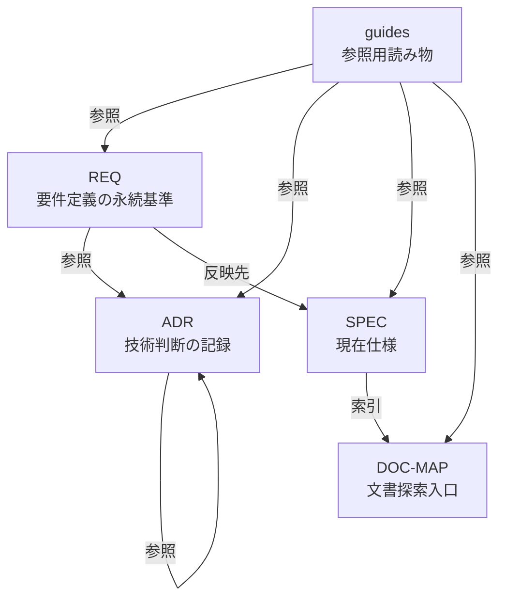
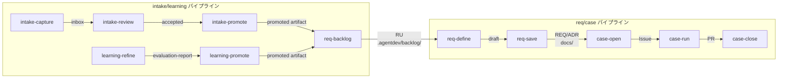

# AgentDevFlow 成果物モデル

AgentDevFlow を構成する成果物の種別・責務・配置・関係・ライフサイクルを説明する。本ガイドは参照用読み物であり、基準は各 REQ/ADR/SPEC ファイルである（REQ-0042-031）。基準文書と矛盾する記述がある場合は基準を優先する（REQ-0042-034）。

## 文書種別モデル

| 種別 | 格納先 | 責務 | 基準性 |
|------|--------|------|--------|
| REQ | `docs/requirements/REQ-{NNNN}.md` | 要件定義の永続基準。RFC 2119言語で記述 | 基準 |
| ADR | `docs/adr/ADR-{NNNN}.md` | 取り返しのつかない技術判断の記録 | 基準 |
| SPEC | `docs/specs/*.md` | 実装者が参照する現在仕様 | 基準 |
| DOC-MAP | `docs/DOC-MAP.md` | 文書探索・参照経路の入口 | 非基準（索引） |
| guides | `docs/guides/*.md` | 利用者向けの参照用読み物 | 非基準（参照用） |

**優先順位**: REQ > ADR > SPEC。DOC-MAP と guides は基準を代替しない（REQ-0042-015, 016, 031）。



**参照ルール**:
- REQ → ADR、ADR → ADR、Issue → ADR の参照を許可（REQ-0042-025）
- ADR → Issue の逆参照は禁止（REQ-0042-023）
- 文書間矛盾時は REQ を優先（REQ-0042-017）

## コマンド・スキル体系

| 成果物 | 格納先 | 責務 |
|--------|--------|------|
| Command | `.opencode/commands/agentdev/` | 実行手順の一次参照（Step番号・入出力契約） |
| Skill | `.opencode/skills/agentdev-*` | 判定基準・共通知識・宣言的ルールの一次参照 |
| Template | Skill配下 `templates/` | Issue/PR本文の出力構造とプレースホルダー |
| Script | Skill配下 `scripts/` | ガードレール・検査・補助処理の実行可能ロジック |

**分離原則**: Command は判定ロジックを直接記述せず Skill を `load_skills` で参照する。Skill は Command の Step 番号やファイルパスを記述しない（REQ-0044-004, 005）。Script は決定的で単体テスト可能な処理に限定する。

**Skill 品質基準**: SKILL.md は500行以下。Progressive Disclosure パターンで詳細は参照ファイル（1階層まで）に配置（REQ-0044-012, 013）。description に `USE FOR:` / `DO NOT USE FOR:` 形式でトリガー条件を記載（REQ-0044-011）。

**Template 配置**:

| 種別 | 配置先 | 所有 Skill |
|------|--------|-----------|
| Issue/コメント/PR | `agentdev-workflow-templates/templates/` | `agentdev-workflow-templates` |
| REQ | `agentdev-req-file-manager/templates/` | `agentdev-req-file-manager` |
| ADR | `agentdev-adr-file-manager/templates/` | `agentdev-adr-file-manager` |
| 乖離検出 | `agentdev-spec-compliance/templates/` | `agentdev-spec-compliance` |

## 成果物ディレクトリ構造

```
docs/
  requirements/REQ-{NNNN}.md    # 要件定義（基準）
  adr/ADR-{NNNN}.md             # アーキテクチャ判断（基準）
  specs/*.md                     # 現在仕様（基準）
  DOC-MAP.md                     # 文書探索入口（非基準）
  guides/*.md                    # 参照用読み物（非基準）
.agentdev/
  intake/                        # Intake パイプライン domain state
    inbox/ accepted/ promoted/ archive/
  learning/                      # Learning パイプライン domain state
    inbox.md archive.md evaluation-report.md promoted/
  backlog/req-units/RU-*.md      # Requirement Unit
  integrity/                     # 整合性検証レポート
.opencode/
  commands/agentdev/             # Command 定義
  skills/agentdev-*/             # Skill 定義（SKILL.md + reference/ + templates/ + scripts/）
.sisyphus/                       # Sisyphus 作業領域（drafts 等）
```

## 成果物間の参照関係



**パイプライン境界**:
- Intake/Learning の promoted artifact を `req-backlog` が RU に統合（REQ-0046-012）
- `req-define` は RU のみを Requirement Source として受け入れ、promoted artifact を直接読み込まない（REQ-0046-019, 020）
- RU は永続化完了（REQ保存成功 or Issue作成成功）後に削除（REQ-0046-021, 022, 023）

## 成果物ライフサイクル概要

| 成果物 | 生成 | 消費 | 削除トリガー |
|--------|------|------|-------------|
| promoted artifact（intake） | `intake-promote` | `req-backlog` | RU化成功時 |
| promoted artifact（learning） | `learning-promote` | `req-backlog` | RU化成功時 |
| RU | `req-backlog` | `req-define`, `req-save`, `case-open` | REQ/Issue永続化完了時 |
| REQ ファイル | `req-save` | `case-open`, `case-run`, `case-close` | なし（永続） |
| Issue | `case-open` | `case-run`, `case-close` | なし（永続） |

**流れ**: promoted artifact → RU → REQ ファイル / Issue → マージ → クローズ。RU 削除は永続化成功に限定し、失敗時は残置する。

**整合性担保**: `integrity-check` が REQ/ADR/SPEC/DOC-MAP の横断的整合性を検査する（REQ-0049-001）。検査結果は finding として分類し、未修正事項は intake へ、再発防止知見は learning へ送る候補として扱う（REQ-0049-012, 013）。

## 基準文書

- REQ-0042: 文書種別の責務・基準境界・参照関係
- REQ-0044: Command/Skill/Template/Script 責任分界
- REQ-0046: intake/learning/req-backlog/RU lifecycle
- REQ-0049: integrity/validation/tests
