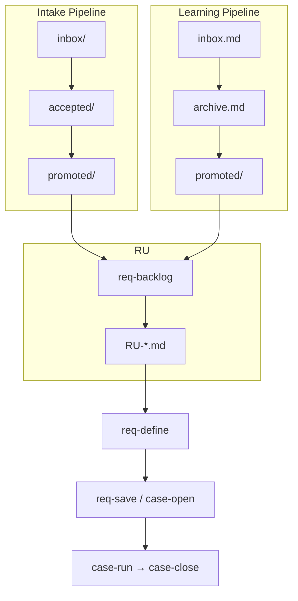
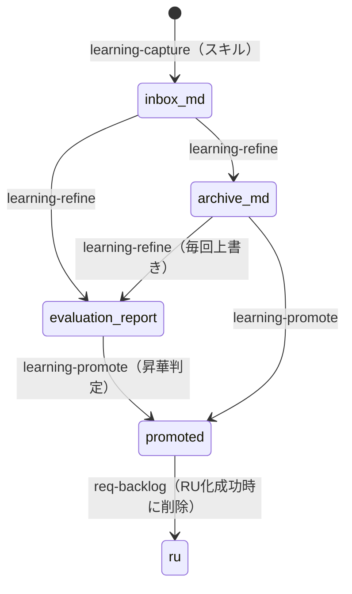
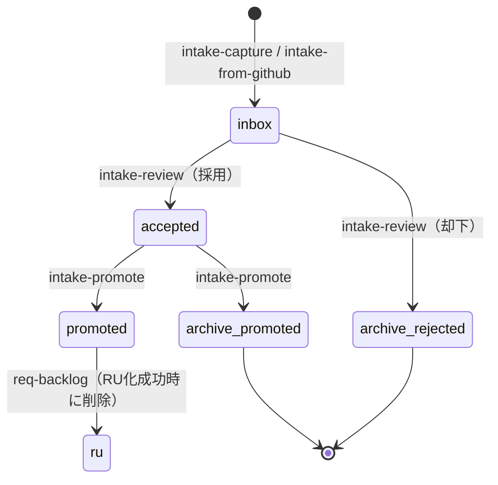
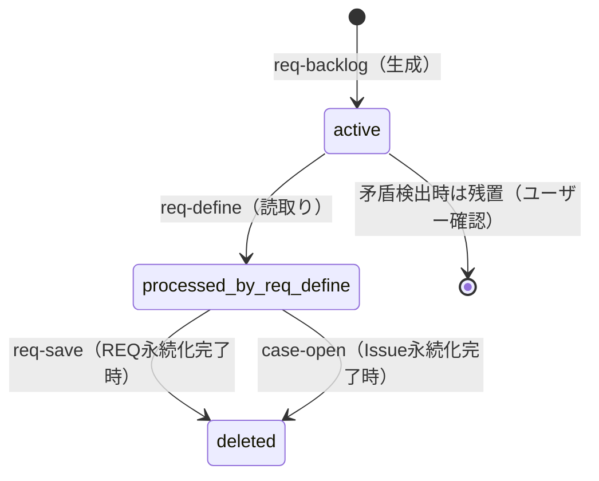
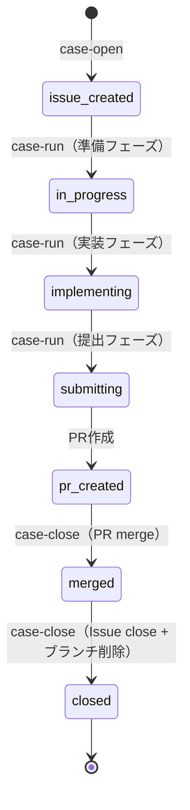
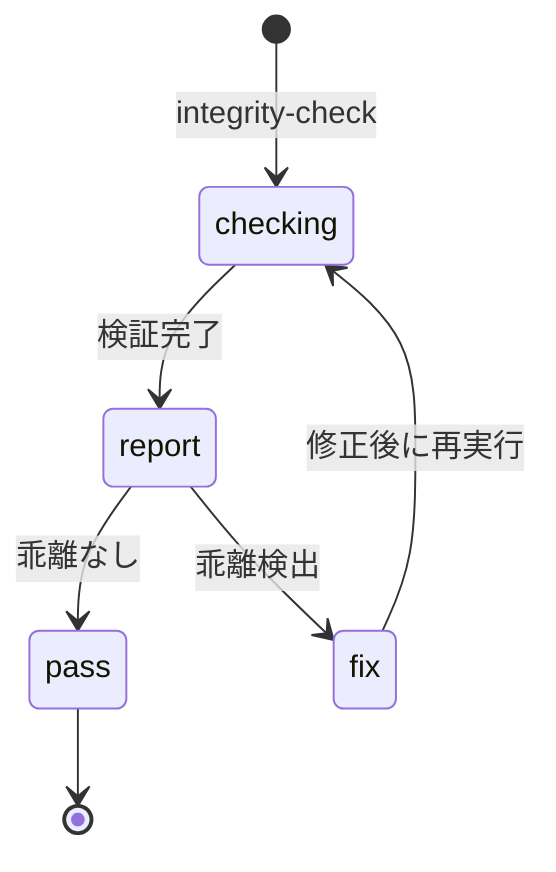

# Domain State Lifecycle

AgentDevFlow の各ドメイン（Learning・Intake・RU・Case・Integrity）におけるファイル・ディレクトリの状態遷移を説明します。

基準となる要件: REQ-0046（intake/learning/RU lifecycle）、REQ-0047（case-run/case-close）、REQ-0042-031~036（guides 規約）。

## 全体概観

## Intake と Learning の境界

両パイプラインは以下の基準で振り分けます。

- **具体的な修正対象が特定できる** → intake
- **再発防止の知見・判断ミス・手順漏れ** → learning
- **両方の性質を持つ** → intake item と learning item に分割

詳細な境界定義は [capture-boundaries](../../.opencode/skills/agentdev-workflow-lifecycle/reference/capture-boundaries.md) を参照。

## Learning Lifecycle

Learning パイプラインは、再発防止に使う知見の蓄積・分類・昇華を目的とします（REQ-0046-007~011）。

### 状態遷移図

### 基本フロー

学び発生 → `learning-capture`（スキル）→ `/agentdev/learning-refine` → `/agentdev/learning-promote` → `/agentdev/req-backlog` → `/agentdev/req-define` に合流

### 主要 artifact

| Artifact | 役割 | 生成トリガー | 対応コマンド | 次に進むコマンド |
|----------|------|-------------|-------------|-----------------|
| `inbox.md` | 未整理 learning entry の active queue | `agentdev-learning-capture` スキルの実行 | なし（スキルが直接書き込み） | `/agentdev/learning-refine` |
| `archive.md` | 分類済み learning entry の蓄積（promote の入力） | `/agentdev/learning-refine` の完了 | `/agentdev/learning-refine` | `/agentdev/learning-promote` |
| `evaluation-report.md` | refine/promote 間の境界 artifact（毎回上書き） | `/agentdev/learning-refine` の完了 | `/agentdev/learning-refine` | `/agentdev/learning-promote` |
| `promoted/` | 昇華判定済み artifact の配置先（req-backlog の入力） | `/agentdev/learning-promote` の完了 | `/agentdev/learning-promote` | `/agentdev/req-backlog` |

- `inbox.md`: capture で蓄積され、refine 成功後にクリアされる。
- `archive.md`: living pool であり、終端保管ではない。未処分・保留中・再評価対象を保持する。
- `evaluation-report.md`: refine と promote の間に位置する境界 artifact で、毎回上書きされる。
- `promoted/`: フラット構造（`*.md`）。サブディレクトリは持たない。frontmatter を持たず、route / status はディレクトリ配置で表現する（REQ-0046-026）。req-backlog による RU 化成功後に削除される。

## Intake Lifecycle

Intake パイプラインは、具体的な作業候補・不整合・未回収課題の収集・レビュー・促進を目的とします（REQ-0046-001~006）。

### 状態遷移図

### 基本フロー

気づき・課題の発生 → `/agentdev/intake-capture` または `/agentdev/intake-from-github` → `/agentdev/intake-review` → `/agentdev/intake-promote` → `/agentdev/req-backlog` → `/agentdev/req-define`

### 主要ディレクトリ

| ディレクトリ | 役割 | 生成トリガー | 対応コマンド | 次に進むコマンド |
|-------------|------|-------------|-------------|-----------------|
| `inbox/` | 収集された気づき・課題の一次受け | `/agentdev/intake-capture` または `/agentdev/intake-from-github` | `/agentdev/intake-capture`, `/agentdev/intake-from-github` | `/agentdev/intake-review` |
| `accepted/` | 採用確定 item の promote 待ち | `/agentdev/intake-review` で採用判定 | `/agentdev/intake-review` | `/agentdev/intake-promote` |
| `archive/rejected/` | 却下 item の記録 | `/agentdev/intake-review` で却下判定 | `/agentdev/intake-review` | なし（終端状態） |
| `promoted/` | req-backlog 入力用の promoted artifact | `/agentdev/intake-promote` の完了 | `/agentdev/intake-promote` | `/agentdev/req-backlog` |
| `archive/promoted/` | promote 済み item の記録 | `/agentdev/intake-promote` の完了 | `/agentdev/intake-promote` | なし（終端状態） |

- `promoted/`: フラット構造（`*.md`）。サブディレクトリは持たない。frontmatter を持たず、route / status はディレクトリ配置で表現する（REQ-0046-026）。req-backlog による RU 化成功後に削除される。

## RU（Requirement Unit）Lifecycle

RU は intake/learning の promoted artifact を分析・統合した構造化成果物で、req-define の Requirement Source として機能する（REQ-0046-012~023）。

### 状態遷移図

### 基本フロー

`req-backlog` が intake/learning の `promoted/*.md` を読み込み → `.agentdev/backlog/req-units/RU-*.md` を生成 → `req-define` が RU を Requirement Source として読み取る → `req-save` または `case-open` で永続化完了後に RU ファイルを削除

### 粒度ルール

- N:1（複数 promoted artifact → 1 RU 統合）を許可
- 1:N（1 promoted artifact → 複数 RU 分割）を許可
- promoted artifact の単純コピー（パススルー）は禁止（REQ-0046-013）

### 矛盾検出

promoted artifact 間に矛盾が検出された場合、矛盾する artifact を RU 化せずユーザーに確認する。矛盾しない artifact は通常通り RU 化を継続する（partial success）（REQ-0046-015）。

### 削除ルール

| トリガー | 実行コマンド | 対象 |
|----------|-------------|------|
| RU の内容が REQ ファイルに永続化完了 | `req-save` | 該当 RU ファイル |
| RU の内容が Issue に永続化完了 | `case-open` | 該当 RU ファイル |
| promoted artifact の RU 化成功 | `req-backlog` | 該当 promoted artifact |

削除トリガーは永続化完了に限定する。永続化未完了の場合は RU を残置する（REQ-0046-023）。

### 禁止事項

- `req-define` は promoted artifact を直接読み込まない（REQ-0046-020）
- `req-backlog` は intake/learning の raw item（inbox.md・archive.md・entries/）を更新しない（REQ-0046-018）

## Case Lifecycle

case-open → case-run → case-close の一連のドメイン状態遷移を説明する（REQ-0047）。

### 状態遷移図

### 主要コマンドと状態

| コマンド | 入力SSoT | 出力SSoT | 状態遷移 |
|----------|---------|---------|---------|
| `case-open` | REQ ファイル / RU | GitHub Issue（Epic + 子Issue の場合あり） | docs → Issue |
| `case-run` | Issue 本文 + Work Plan | 実装済みブランチ + PR | Issue → PR |
| `case-close` | PR + Issue | マージ済み + 記録追記済み + ブランチ削除 | PR → 完了 |

### case-run の3フェーズ構成

case-run は準備・実装・提出の3フェーズでべき等な再開ポイントを提供する（REQ-0047-001）。

| フェーズ | 内容 |
|----------|------|
| 準備 | Issue 読取り・worktree 作成・Plan 策定 |
| 実装 | 実装・テスト・docs/specs 整合性確認 |
| 提出 | コミット・PR 作成・チェックボックス更新 |

### PR 本文永続チャネル

case-run で発見した本筋外 Finding（intake 候補・learning 候補）は、PR 本文の「Findings / Intake候補」セクションに記録する（REQ-0047-008）。case-close はマージ済み PR 本文からこのセクションを回収し、intake item 形式で `.agentdev/intake/inbox/` に保存する（REQ-0047-015）。

- case-run は `.agentdev/intake/inbox/` を直接変更しない（REQ-0047-009）
- case-close は PR 本文の情報を推測で補完しない（REQ-0047-017）
- Epic モード時は子 Issue PR 群を横断走査して回収する（REQ-0047-016）

## Integrity Lifecycle

Integrity パイプラインは、AgentDevFlow artifact（REQ/ADR/Skill/Command/Template）の横断的整合性検証を目的とします（REQ-0049）。

### 状態遷移図

### 基本フロー

検査契機発生 → `/agentdev/integrity-check` → 検証レポート生成 → 乖離がある場合は対応コマンドへ

### 主要 artifact

| Artifact | 役割 | 生成トリガー | 対応コマンド | 次に進むコマンド |
|----------|------|-------------|-------------|-----------------|
| `reports/` | 検証結果レポートの保存 | `/agentdev/integrity-check` の完了 | `/agentdev/integrity-check` | 乖離検出時: 該当コマンドで修正 → 再実行 |

REQ/ADR の frontmatter 整合性、スキル構造、コマンド定義のクロスリファレンス等を検証します。詳細な検証項目は `agentdev-integrity` スキルを参照。
