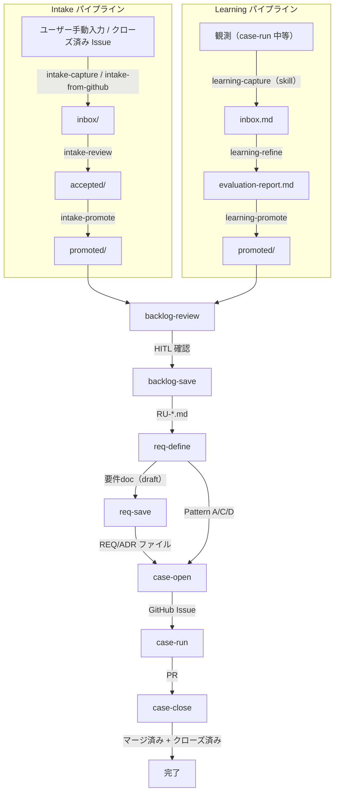

# AgentDevFlow ワークフロー概要

本ガイドは AgentDevFlow の生成物の流れを中心に説明する。各コマンドが前工程の生成物を入力とし、次工程の生成物を出力する関係を示す。基準は各 REQ/ADR/SPEC ファイルであり、本ガイドは参照用読み物である（REQ-0101）。基準文書と矛盾する記述がある場合、基準を優先する（REQ-0101）。

## 生成物の流れ

## Intake パイプライン

具体的な作業候補を収集し、要件化への入力に変換する。

| 前工程の生成物 | コマンド | 出力 | 備考 |
|----------|------|------|------|
| ユーザー手動入力 | `intake-capture` | `inbox/` | 推測不能な項目は省略 |
| クローズ済み Issue/PR | `intake-from-github` | `inbox/` | 残課題を抽出 |
| `inbox/` | `intake-review` | `accepted/` / `archive/` | 採用・却下・保留に判定 |
| `accepted/` | `intake-promote` | `promoted/` | Issue化に必要な最小情報を含む |

## Learning パイプライン

再発防止知見を蓄積し、要件定義への入力に変換する。

| 前工程の生成物 | コマンド | 出力 |
|----------|------|------|
| 観測（case-run 中等） | `learning-capture`（skill） | `inbox.md` |
| `inbox.md` + `archive/active.md` | `learning-refine` | `evaluation-report.md` |
| `evaluation-report.md` + `archive/` | `learning-promote` | `promoted/`（Requirement Source stub） |

## Backlog パイプライン

intake/learning 両方の promoted artifact を RU に統合する。

| 前工程の生成物 | コマンド | 出力 | 備考 |
|----------|------|------|------|
| `promoted/`（intake/learning） | `backlog-review` | review draft | 分析・統合結果をユーザーに確認（HITL） |
| review draft | `backlog-save` | `RU-*.md` | RU 生成成功後に元の promoted artifact を削除 |

RU の粒度: N:1（複数 artifact を 1 RU に統合）、1:N（1 artifact を複数 RU に分割）。

## 要件定義パイプライン

| 前工程の生成物 | コマンド | 出力 | 備考 |
|----------|------|------|------|
| セッション会話 / RU | `req-define` | 要件doc（draft） | AI と対話して要件を整理 |
| 要件doc（Pattern B のみ） | `req-save` | REQ/ADR ファイル | commit/push まで実行 |

`req-define` の処理:
1. 既存 `REQ-*.md` をスキャンし、関連する既存REQを特定
2. 操作分類（CREATE / APPEND / UPDATE）を決定。CREATE の前に必ず APPEND/UPDATE 候補を評価
3. Pattern と Scale を判定し、要件doc構造を出力
4. 関連ドキュメント更新候補を抽出

**分類ゲート**: 既存成果物への反映作業のみを表す候補は、新規REQの独立要件行として扱わない（REQ-0102）。

## Case実行パイプライン

| 前工程の生成物 | コマンド | 出力 | 備考 |
|----------|------|------|------|
| REQ ファイル / 要件doc | `case-open` | GitHub Issue | Pattern B で `scale: large` の場合は Epic + 子Issue |
| Issue | `case-run` | 実装済みブランチ + PR | 3フェーズ構成（準備・実装・提出） |
| PR | `case-close` | マージ済み + クローズ済み | Findings/Intake候補を回収 |

### case-run の3フェーズ

| フェーズ | 内容 |
|----------|------|
| 準備 | Issue読取・Plan策定・worktree作成 |
| 実装 | Planに沿った実装・コミット・関連docs整合性確認 |
| 提出 | PR作成・チェックボックス更新・Findings記録 |

### case-close の完了前検証

- 未チェック項目の達成判定（達成済みなら自動 `[x]` 更新）
- 要件・SPEC・DOC-MAP の整合性
- ADR 作成済みかの確認
- マージ済みPR本文から Findings/Intake候補を回収し、intake item として保存

## フェーズ体系

ワークフローは3つのマクロフェーズで構成される。

| マクロフェーズ | 対応マイクロフェーズ | SSoT境界 |
|---------------|---------------------|---------|
| 壁打ち | `requirement` → `analyzed` | docs変更をcommit/push |
| 構造的実行 | `created` → `in_progress` | Issue本文がSSoT |
| レビュー完了 | `review` → `done` | PR + IssueがSSoT |

| マイクロフェーズ | 状態 | マクロフェーズ |
|-----------------|------|---------------|
| `requirement` | 要件定義中 | 壁打ち |
| `analyzed` | 分析完了・Issue未作成 | 壁打ち |
| `created` | Issue作成済み・作業前 | 構造的実行 |
| `in_progress` | 実装中 | 構造的実行 |
| `review` | PR作成済み・レビュー中 | レビュー完了 |
| `done` | 完了（post-run capture 含む） | レビュー完了 |

## Pattern分類

Issueのラベルに基づき4つのPatternに分類する。Patternにより経路（req-saveの要否）と docs 更新範囲が変わる。

| Pattern | 名称 | ラベル | REQ | ADR | specs更新 | ブランチ種別 |
|---------|------|--------|-----|-----|----------|-------------|
| A | バグ修正・軽微変更 | `bug`, `critical` | 不要 | 必要に応じて | 不要 | `fix` |
| B | 機能追加 | `enhancement`, `feature` | 必要 | 必要 | 必要 | `feature` |
| C | リファクタリング・保守作業 | `refactor`, `maintenance` | 不要 | 必要に応じて | 不要 | `refactor` |
| D | ドキュメント・雑務 | `docs`, `chore` | 不要 | 必要に応じて | 不要 | `chore` |

**Pattern B の規模判定**: 複数モジュール跨ぎ・PR肥大化リスク・段階的リリースのいずれかを満たす場合、Epic規模（`scale: large`）として扱い、Epic + 子Issue構成で実行する。

**昇格ルール**: Pattern A で ADR が必要と判定された場合、Pattern B に昇格し req-save を実行する。

## 参照基準

本ガイドの記述は以下の基準文書に依拠する。

| 対象 | 基準 |
|------|------|
| 文書構造・guides位置づけ | [REQ-0101](../requirements/REQ-0101.md) |
| req-define / req-save / 分類ゲート | [REQ-0102](../requirements/REQ-0102.md) |
| コマンドプロトコル・Pattern体系・SSoT | [REQ-0104](../requirements/REQ-0104.md) |
| intake / learning / backlog-review / backlog-save / RU lifecycle | [REQ-0105](../requirements/REQ-0105.md) |
| case-run / case-close / post-run capture | [REQ-0106](../requirements/REQ-0106.md) |
