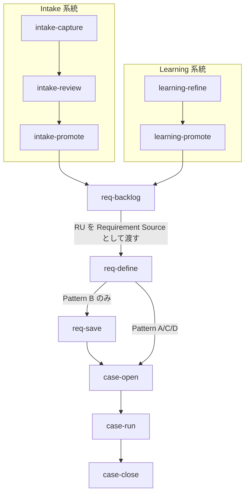

# AgentDevFlow ワークフロー概要

本ガイドは AgentDevFlow のコマンドパイプライン・フェーズ体系・Pattern分類を俯瞰的に説明する。基準は各 REQ/ADR/SPEC ファイルであり、本ガイドは参照用読み物である（REQ-0042-031）。基準文書と矛盾する記述がある場合、基準を優先する（REQ-0042-034）。

## 全体パイプライン

AgentDevFlow は3つの系統を持つ。いずれも `req-define` に合流し、以降は共通のCase実行パイプラインを通る。



| 系統 | 入口コマンド | 目的 |
|------|-------------|------|
| 通常開発 | `req-define` | 機能追加・バグ修正の要件定義から実装まで |
| Intake | `intake-capture` | 作業候補の収集・分類・要件化 |
| Learning | `learning-refine` | 再発防止知見の蓄積・要件化 |

## 要件定義パイプライン

### req-define

AIとの対話を通じて要件を整理する。入力はセッション会話、出力は要件doc。

処理の流れ:
1. 既存 `REQ-*.md` をスキャンし、ユーザーの要件と関連する既存REQを特定
2. 操作分類（CREATE / APPEND / UPDATE）を決定 — CREATEの前に必ずAPPEND/UPDATE候補を評価
3. Pattern と Scale を判定し、要件doc構造を出力
4. 関連ドキュメント更新候補を抽出（直接矛盾 / 更新候補 / 影響なし）

**分類ゲート**: 既存成果物への反映作業のみを表す候補は、新規REQの独立要件行として扱わない（REQ-0043-012）。

### req-save

壁打ち成果物（`.sisyphus/drafts/`）を基準文書として保存する。Pattern B（機能追加）のみ実行する。

- REQ ファイル（`docs/requirements/REQ-{NNNN}.md`）を CREATE
- `adr-required: true` の場合、ADR ファイル（`docs/adr/ADR-{NNNN}.md`）を CREATE
- 保存後に `requirements/README.md` と `docs/README.md` の整合性を検証
- commit / push まで実行

## Case実行パイプライン

### case-open

要件docと specs・ADR を読み取り、GitHub Issue を出力する。Pattern B で `scale: large` の場合、Epic + 子Issue を一括作成する。

### case-run

GitHub Issue を読み取り、worktree 上で実装し、PR を作成する。3フェーズ構成でべき等な再開ポイントを提供する（REQ-0047-001）。

| フェーズ | 内容 |
|----------|------|
| 準備 | Issue読取・Plan策定・worktree作成 |
| 実装 | Planに沿った実装・コミット・関連docs整合性確認 |
| 提出 | PR作成・チェックボックス更新・Findings記録 |

実装完了後、ローカルdiffからキーワードを抽出し `docs/specs/` で矛盾がないか自動確認する。本筋外の発見はPR本文の「Findings / Intake候補」セクションに記録する。

### case-close

PRマージ・Issueクローズ・ブランチ削除を実行する。完了前に以下を検証する:
- 未チェック項目の達成判定（達成済みなら自動 `[x]` 更新）
- 要件・SPEC・DOC-MAP の整合性
- ADR 作成済みかの確認
- マージ済みPR本文から Findings/Intake候補を回収し、intake item として保存

## Intake / Learning パイプライン

```mermaid
flowchart LR
    subgraph Intake["Intake pipeline"]
        IC[intake-capture<br/>intake-from-github]
        IR[intake-review]
        IP[intake-promote]
    end
    subgraph Learning["Learning pipeline"]
        LC[learning-capture<br/>（skill）]
        LRef[learning-refine]
        LProm[learning-promote]
    end

    IC -->|".agentdev/intake/inbox/"| IR
    IR -->|採用→ accepted/"| IP
    IR -->|却下→ archive/|
    IP -->|"promoted/"| RB[req-backlog]
    LC -->|inbox.md| LRef
    LRef -->|evaluation-report.md| LProm
    LProm -->|"promoted/"| RB
    RB -->|"RU-*.md"| RD[req-define]
```

### Intake パイプライン

具体的な作業候補を収集し、要件化への入力に変換する。

| コマンド | 入力 | 出力 | 備考 |
|----------|------|------|------|
| intake-capture | ユーザー手動入力 | `.agentdev/intake/inbox/` | 推測不能な項目は省略 |
| intake-from-github | クローズ済み Issue/PR | `.agentdev/intake/inbox/` | 残課題を抽出 |
| intake-review | inbox の item | accepted / archive | 採用・却下・保留に判定 |
| intake-promote | accepted の item | `.agentdev/intake/promoted/` | Issue化に必要な最小情報を含む |

### Learning パイプライン

再発防止知見を蓄積し、要件定義への入力に昇華する。

| コマンド | 入力 | 出力 |
|----------|------|------|
| learning-capture（skill） | 観測 | `.agentdev/learning/inbox.md` |
| learning-refine | inbox.md + archive.md | `evaluation-report.md` |
| learning-promote | evaluation-report + archive | `.agentdev/learning/promoted/`（Requirement Source stub） |

### req-backlog と RU lifecycle

`req-backlog` は intake/learning 両方の promoted artifact を読み込み、分析・統合して Requirement Unit（RU）を生成する。

- RU の粒度: N:1（複数artifact → 1RU統合）および 1:N（1artifact → 複数RU分割）
- promoted artifact 間の矛盾はユーザーに確認
- RU 生成成功後、元の promoted artifact を削除
- `req-define` は RU を Requirement Source として受け入れる
- `req-save`（REQ保存）または `case-open`（Issue作成）の成功後、該当RUファイルを削除

## フェーズ体系

ワークフローは3つのマクロフェーズで構成される。

| マクロフェーズ | 対応マイクロフェーズ | SSoT境界 |
|---------------|---------------------|---------|
| 壁打ち | `requirement` → `analyzed` | docs変更をcommit/push |
| 構造的実行 | `created` → `in_progress` | Issue本文がSSoT |
| レビュー完了 | `review` → `done` | PR + IssueがSSoT |

| マイクロフェーズ | 状態 | マクロフェーズ |
|-----------------|------|---------------|
| `requirement` | 要件定義中 | 壁打ち |
| `analyzed` | 分析完了・Issue未作成 | 壁打ち |
| `created` | Issue作成済み・作業前 | 構造的実行 |
| `in_progress` | 実装中 | 構造的実行 |
| `review` | PR作成済み・レビュー中 | レビュー完了 |
| `done` | 完了（post-run capture 含む） | レビュー完了 |

## Pattern分類

Issueのラベルに基づき4つのPatternに分類する。Patternにより経路（req-saveの要否）と docs 更新範囲が変わる。

| Pattern | 名称 | ラベル | REQ | ADR | specs更新 | ブランチ種別 |
|---------|------|--------|-----|-----|----------|-------------|
| A | バグ修正・軽微変更 | `bug`, `critical` | 不要 | 必要に応じて | 不要 | `fix` |
| B | 機能追加 | `enhancement`, `feature` | 必要 | 必要 | 必要 | `feature` |
| C | リファクタリング・保守作業 | `refactor`, `maintenance` | 不要 | 必要に応じて | 不要 | `refactor` |
| D | ドキュメント・雑務 | `docs`, `chore` | 不要 | 必要に応じて | 不要 | `chore` |

**Pattern B の規模判定**: 複数モジュール跨ぎ・PR肥大化リスク・段階的リリースのいずれかを満たす場合、Epic規模（`scale: large`）として扱い、Epic + 子Issue構成で実行する。

**昇格ルール**: Pattern A で ADR が必要と判定された場合、Pattern B に昇格し req-save を実行する。

## 参照基準

本ガイドの記述は以下の基準文書に依拠する。

| 対象 | 基準 |
|------|------|
| 文書構造・guides位置づけ | [REQ-0042](../requirements/REQ-0042.md) |
| req-define / req-save / 分類ゲート | [REQ-0043](../requirements/REQ-0043.md) |
| コマンドプロトコル・Pattern体系・SSoT | [REQ-0045](../requirements/REQ-0045.md) |
| intake / learning / req-backlog / RU lifecycle | [REQ-0046](../requirements/REQ-0046.md) |
| case-run / case-close / post-run capture | [REQ-0047](../requirements/REQ-0047.md) |
